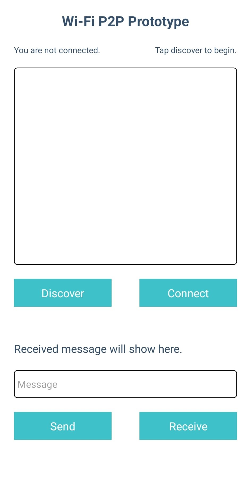
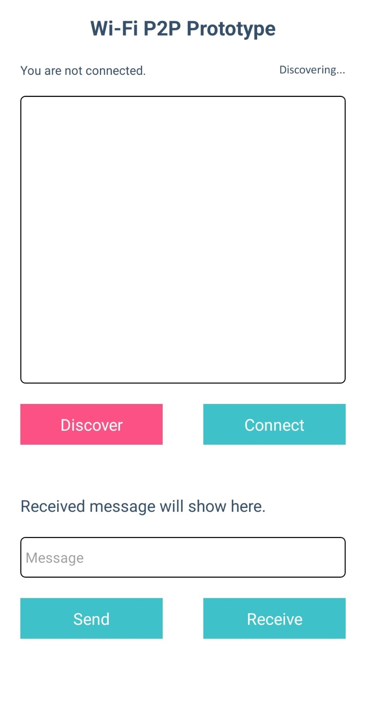
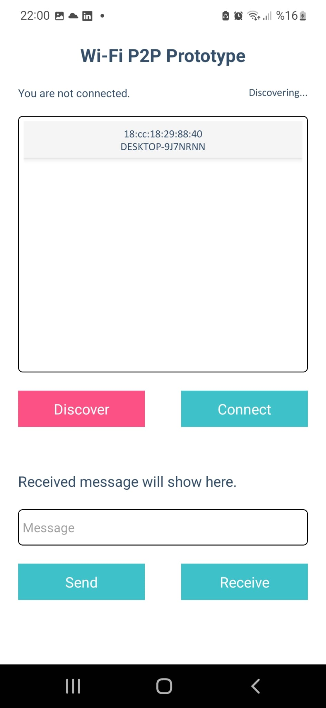

# Wi-Fi Direct (P2P) Messaging Prototype

A prototype for testing **Android Wi-Fi Direct (P2P)** messaging using **React Native**, **Expo**, and **react-native-wifi-p2p**.  
Built to explore peer-to-peer connections in Android devices, for a bigger project that aims to create a mesh network with the peer connections. 

---

## Overview

This prototype allows to:
- Discover nearby peers using Wi-Fi Direct
- Connect to a selected peer
- Send and receive a text message

The received message appears in the app’s interface.

---

## Demo





---

## Tech

- [React Native](https://reactnative.dev/)  
- [Expo](https://docs.expo.dev/)  
- [react-native-wifi-p2p](https://github.com/kirillzyusko/react-native-wifi-p2p)

---

## Setup & Run

**Requirements**
- Android device with Wi-Fi Direct support
- Node.js and npm/yarn/pnpm
- An Expo dev build, as Expo Go does not support native modules.

**Steps**

### 1. Clone the repo
### 2. Install dependencies
```npm install``` or ```yarn / pnpm install```
### 4. [Create a development build APK file for the application.](https://docs.expo.dev/guides/local-app-development/)
### 5. Install the development build to the target device.
### 6. Start the Metro bundler for the project
```npx expo start```
### 7. Scan the QR code once displayed to connect the Metro bundler to the development build.
